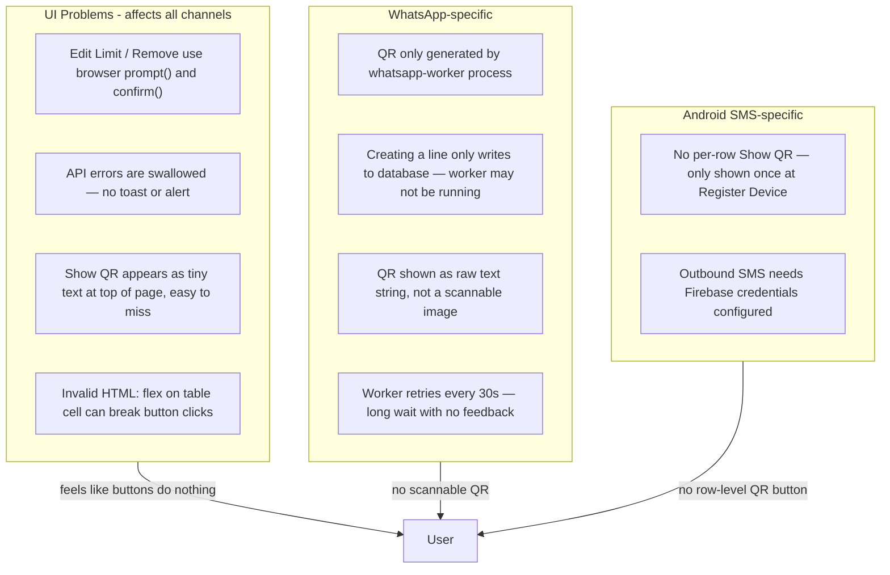
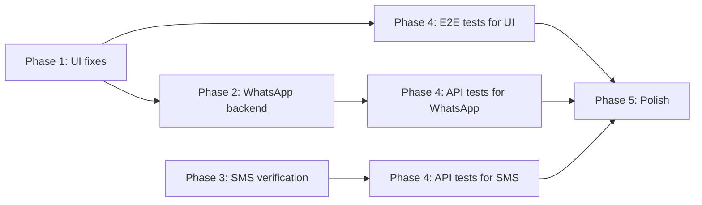

# Fix Connector Bugs, Improve UX, and Add Automated Testing

## What You're Experiencing (Root Causes)

Your symptoms map to **three separate problems**, not one mystery bug:



### Why buttons feel dead

All connector actions live in one file: [`app/workers/page.tsx`](app/workers/page.tsx).

| Button | What actually happens | Why it feels broken |
|--------|----------------------|---------------------|
| **Edit Limit** | Opens browser `prompt()` dialog, then calls `PUT /api/workers` | Cancel/empty input = silent no-op. API failures ignored. |
| **Remove** | Opens browser `confirm()` dialog, then calls `DELETE /api/workers` | Same silent failure pattern. |
| **Show QR** (WhatsApp only) | Sets local state — banner renders **above the table** as plain text | No modal, no scannable image, easy to miss if scrolled down. |

The handlers **are wired** — this is a UX and feedback problem, not missing code. However, `className="py-4 flex gap-2"` on a `<td>` (line 263) is invalid HTML and can cause layout/click issues in some browsers; this will be fixed.

### Why WhatsApp QR never appears

1. **Two-process requirement**: `POST /api/connectors` ([`app/api/connectors/route.ts`](app/api/connectors/route.ts)) only creates a database record. The actual QR is generated by [`workers/whatsapp-worker.ts`](workers/whatsapp-worker.ts), which must be running (`npm run worker:whatsapp` or the `whatsapp-worker` service in [`docker-compose.yml`](docker-compose.yml)).
2. **Up to 30-second delay**: The worker polls for new connectors every 30s — no immediate trigger after create.
3. **Not scannable even when it works**: The UI renders the QR payload as monospace text (line 184), not as a QR image. Android SMS correctly uses a scannable image via `api.qrserver.com` (line 193).

Since you're unsure how the app is run, the plan includes **automatic worker-health detection** in the UI so you'll see a clear message like "WhatsApp worker offline — QR cannot be generated" instead of silent failure.

---

## Implementation Plan

### Phase 1 — Fix the Devices page (immediate, highest impact)

**Goal:** Every button gives visible, immediate feedback. No more browser `prompt()`/`confirm()`.

**1.1 Replace native dialogs with in-app modals**

Create lightweight reusable components in `components/`:
- `ConfirmDialog` — for Remove
- `EditLimitDialog` — number input with Save/Cancel
- `QrModal` — centered modal with scannable QR image, status text, and Close button

Replace all `prompt()` / `confirm()` / `alert()` calls in [`app/workers/page.tsx`](app/workers/page.tsx).

**1.2 Fix table action column HTML**

Change the Actions cell from:
```tsx
<td className="py-4 flex gap-2 justify-end">
```
to:
```tsx
<td className="py-4 text-right">
  <div className="flex gap-2 justify-end">
```
Add `type="button"` to all action buttons.

**1.3 Render WhatsApp QR as a scannable image**

Use the same approach as Android SMS — render via QR image URL:
```tsx

```
Only render the image when `qrData.qr` is not the placeholder `"Waiting for QR..."`.

**1.4 Add toast notifications**

Add a minimal toast system (no heavy UI library needed — a small `components/toast.tsx` + context). Show success/error for:
- Edit limit saved / failed
- Connector removed / failed
- WhatsApp line created / failed
- Android device registered / failed

**1.5 Add loading and disabled states**

Disable action buttons while a request is in-flight to prevent double-clicks and show a spinner on the clicked button.

**1.6 Worker health banner (WhatsApp tab)**

Add `GET /api/connectors/health` endpoint that checks:
- Redis reachable
- At least one WhatsApp profile received a `lastPing` update in the last 60s **or** a BullMQ heartbeat key written by the worker

Show a yellow/red banner on the WhatsApp tab when the worker is not running, with plain-English instructions:
> "Start the WhatsApp worker: run `docker compose up` or `npm run worker:whatsapp`"

---

### Phase 2 — Fix WhatsApp backend reliability

**Goal:** QR appears within seconds of adding a line; reconnect works after disconnect.

**2.1 Immediate session trigger on create**

In [`app/api/connectors/route.ts`](app/api/connectors/route.ts) `POST`, after creating the Profile, publish a Redis message (e.g. `wasp:session:create`) that the worker listens for. This replaces the 30s polling delay.

**2.2 Fix worker session lifecycle bugs** in [`workers/whatsapp-worker.ts`](workers/whatsapp-worker.ts):

| Bug | Fix |
|-----|-----|
| `qrCode: undefined` doesn't unset field in Mongo | Use `{ $unset: { qrCode: 1 } }` on connect/disconnect |
| Disconnected sessions keep stale `qrCode`, blocking retry query | Clear `qrCode` on `SESSION_DISCONNECTED`; recreate session |
| Pending query `{ qrCode: { $exists: false } }` misses stale docs | Change to `{ $or: [{ qrCode: { $exists: false } }, { qrCode: null }] }` or always `$unset` |
| Delete connector doesn't tear down WaSP session | On `DELETE /api/workers`, if channel is WHATSAPP, publish destroy event; worker calls `wasp.destroySession(sessionId)` |

**2.3 Add "Re-pair" action**

Show **Show QR** button for `inactive` WhatsApp connectors (already partially there) and add a **Re-pair** button for disconnected active connectors that clears the session and triggers a fresh QR.

**2.4 QR polling improvements**

In the frontend QR poll effect (lines 41–57):
- Check `res.ok` before parsing JSON
- Show error state in the QR modal if 404 or worker offline
- Stop polling when modal is closed

---

### Phase 3 — Android SMS end-to-end verification and fixes

**Goal:** Confirm send/receive works; surface configuration gaps clearly.

**3.1 Add per-row "Show Setup QR" for pending SMS devices**

For SMS connectors with `status: 'pending'`, add a row action that re-displays the API key QR (stored hashed — only the key shown at creation time is scannable; for re-pair, generate a new key via a `POST /api/gateway/devices/[id]/rotate-key` endpoint).

**3.2 Configuration status in UI**

On the SMS tab, show clear banners when:
- `FIREBASE_PROJECT_ID` / credentials missing → "Outbound SMS disabled — Firebase not configured" (check via new `GET /api/gateway/health`)
- Device has no `fcmToken` → "Device registered but app not connected yet"
- No `assignedLocationId` → "Assign this device to a GHL location on Subaccounts page"

**3.3 Verify and fix message flows**

Trace and fix any gaps in:
- Inbound: [`app/api/gateway/devices/[id]/receive-sms/route.ts`](app/api/gateway/devices/[id]/receive-sms/route.ts) → GHL inject
- Outbound: [`lib/sms/fcm.ts`](lib/sms/fcm.ts) → Android app
- Status sync: [`app/api/gateway/devices/[id]/sms-status/route.ts`](app/api/gateway/devices/[id]/sms-status/route.ts)

**3.4 Monitor page improvements**

In [`app/monitor/page.tsx`](app/monitor/page.tsx), show per-channel error counts and last failure reason (not just queue depth).

---

### Phase 4 — Automated testing (so AI catches bugs for you)

**Goal:** Every future change is verified automatically. You won't need to manually click through the app.

**4.1 Add Vitest for unit and API tests**

Add to [`package.json`](package.json):
```json
"test": "vitest run",
"test:watch": "vitest"
```

Dev dependencies: `vitest`, `@vitejs/plugin-react`, `mongodb-memory-server`, `supertest` (or Next.js route testing).

Initial test files:
- `lib/routing/channelRouter.test.ts` — routing logic
- `lib/connectors/assign.test.ts` — connector assignment
- `lib/gateway/auth.test.ts` — API key validation
- `app/api/workers/route.test.ts` — PUT/DELETE with in-memory Mongo
- `app/api/connectors/route.test.ts` — create + QR read
- `app/api/gateway/devices/route.test.ts` — register + link flow

**4.2 Add Playwright for UI smoke tests**

```json
"test:e2e": "playwright test"
```

Key E2E scenarios (run against `docker compose up` in CI):
1. Workers page loads all three tabs
2. Create WhatsApp connector → QR modal opens → shows waiting or QR image
3. Edit Limit via dialog → value updates in table
4. Remove connector via confirm dialog → row disappears
5. Register Android device → QR image visible
6. Monitor page shows stats cards

Replace `prompt()`/`confirm()` **before** writing E2E tests (Phase 1 is a prerequisite).

**4.3 Add GitHub Actions CI**

Create `.github/workflows/ci.yml`:
```
lint → build → vitest → (optional) playwright against docker-compose
```

**4.4 Add test docker-compose overlay**

Create `docker-compose.test.yml` with ephemeral Mongo/Redis ports for isolated test runs.

**4.5 Include `workers/` in TypeScript compilation**

Remove the `workers/` exclude from [`tsconfig.json`](tsconfig.json) so worker code is type-checked and testable.

---

### Phase 5 — Operational polish (reduce back-and-forth)

**5.1 Single-command startup script**

Add `npm run dev:all` that starts Next.js + whatsapp-worker concurrently (using `concurrently` package), so you don't need to remember two terminals.

**5.2 Update `.env.example`**

Document all required env vars with plain-English comments:
- `REDIS_URL` — required for WhatsApp
- `FIREBASE_*` — required for Android SMS outbound
- `ADMIN_API_KEY` — optional admin protection

**5.3 Health dashboard endpoint**

Extend [`app/api/dashboard/stats/route.ts`](app/api/dashboard/stats/route.ts) with:
- `whatsappWorkerOnline: boolean`
- `firebaseConfigured: boolean`
- `connectorsNeedingAttention: number` (unassigned, pending, inactive)

Show these on the Monitor page as traffic-light indicators.

---

## Execution Order (AI will follow this sequence)



Phases 1 and 2 unblock you immediately. Phase 4 ensures fixes stay fixed. Phase 5 makes daily use smoother.

---

## What You'll Need to Do (minimal)

After AI implements the fixes, you'll only need to:

1. **Start the app** — run `docker compose up` (recommended, starts everything) or ask AI to set up `npm run dev:all`
2. **Configure `.env`** — copy `.env.example` to `.env`; AI will flag what's missing via health banners
3. **Scan QR codes** — WhatsApp: phone camera on the modal QR; Android: scan from the Android app
4. **Assign connectors** — link each connector to a GHL location on the Subaccounts page (required before messages flow)

Everything else — code fixes, tests, CI, error messages — is handled by AI.

---

## Key Files to Change

| File | Changes |
|------|---------|
| [`app/workers/page.tsx`](app/workers/page.tsx) | Modals, toasts, QR image, fix table HTML, health banner |
| [`workers/whatsapp-worker.ts`](workers/whatsapp-worker.ts) | Redis trigger listener, session cleanup, $unset fixes |
| [`app/api/connectors/route.ts`](app/api/connectors/route.ts) | Publish session-create on POST |
| [`app/api/workers/route.ts`](app/api/workers/route.ts) | Publish session-destroy on DELETE for WhatsApp |
| New: `components/confirm-dialog.tsx`, `components/qr-modal.tsx`, `components/toast.tsx` | Reusable UI |
| New: `app/api/connectors/health/route.ts`, `app/api/gateway/health/route.ts` | Health checks |
| New: `*.test.ts`, `e2e/*.spec.ts`, `.github/workflows/ci.yml` | Automated testing |
| [`package.json`](package.json) | Test scripts, `dev:all` script |
| [`docker-compose.yml`](docker-compose.yml) | Optional test overlay |
