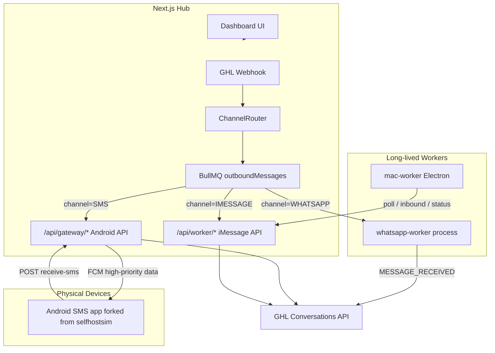
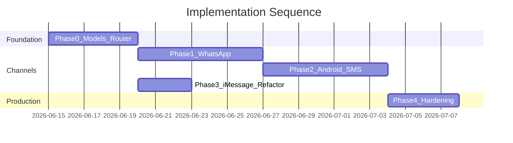

# Multi-Channel Gateway Rebuild (Revised Plan)cc

## Verdict on Gemini's Proposal

**What Gemini got right**

- Decouple long-lived messaging connections from the Next.js API layer
- Use `wasp-protocol` + Baileys for WhatsApp Web emulation with Redis-backed sessions
- Use Android + FCM push for carrier SMS (matching [selfhostsim](https://github.com/ampilares/selfhostsim))
- Shared anti-ban rate limiting (20–45s drip) across channels
- Redis is already in your stack (`[docker-compose.yml](docker-compose.yml)`, `[lib/queue/redis.ts](lib/queue/redis.ts)`)

**What Gemini got wrong or underspecified**


| Issue            | Gemini says                                                                                                     | Better approach                                                                                                           |
| ---------------- | --------------------------------------------------------------------------------------------------------------- | ------------------------------------------------------------------------------------------------------------------------- |
| iMessage         | Delete `mac-worker/` in Phase 1                                                                                 | **Keep and refactor** — you confirmed iMessage stays in parallel                                                          |
| WaSP in webhooks | Call `wasp.sendMessage()` from `[app/api/ghl/webhook/messages/route.ts](app/api/ghl/webhook/messages/route.ts)` | **Never** — WaSP needs a persistent process; webhooks only enqueue jobs                                                   |
| Queue layer      | Implicit WaSP internal queue only                                                                               | **Extend existing BullMQ** as the unified outbound router; WaSP queue handles Baileys anti-ban inside the WhatsApp worker |
| Worker API       | Delete all of `app/api/worker/`*                                                                                | **Keep poll/inbound/status** for iMessage; add new `/api/gateway/`* for Android                                           |
| MMS (Phase 4)    | Full MMS pipeline                                                                                               | **Defer** — selfhostsim has **no MMS**; this phase is speculative                                                         |
| Docker worker    | `npx ts-node whatsapp-worker.ts`                                                                                | Compile to JS or add a `worker` npm script with `tsx`/`node dist/`                                                        |
| Security         | Not mentioned                                                                                                   | Admin APIs are **unauthenticated today** — must fix before production                                                     |
| Outbound paths   | Only mentions GHL webhook                                                                                       | You have **3 outbound entry points** that need consolidation                                                              |
| Device model     | `deviceId` on Message only                                                                                      | Need a **channel-aware Connector model** replacing Mac-only `Profile`                                                     |


---

## Target Architecture




**Core principle:** GHL webhooks create a `Message` record and enqueue **one** BullMQ job. A channel dispatcher resolves `locationId → Connector` and hands off to the right transport. Each transport reports status back through a shared status-sync module (reuse logic from `[app/api/worker/status/route.ts](app/api/worker/status/route.ts)` and `[lib/ghl.ts](lib/ghl.ts)`).

---

## Phase 0: Foundation (Do Before Any Channel Work)

### 0.1 Introduce channel-aware data model

Extend `[models/Message.ts](models/Message.ts)`:

```typescript
channel: { type: String, enum: ['IMESSAGE', 'WHATSAPP', 'SMS'], required: true }
deviceId: String   // connector ID regardless of channel
// keep existing: phone, body, attachments, status, locationId, ghlMessageId, etc.
```

Evolve `[models/Profile.ts](models/Profile.ts)` into `Connector` (or extend Profile in-place):

```typescript
connectorId: string        // was workerId for iMessage
channel: 'IMESSAGE' | 'WHATSAPP' | 'SMS'
assignedLocationId: string
// channel-specific fields:
fcmToken?: string           // SMS
sessionId?: string          // WhatsApp (maps to wasp session)
appleId?: string            // iMessage
apiKey?: string             // SMS device auth (selfhostsim pattern)
status, lastPing, dailyCount, dailyLimit  // keep existing
```

Migration script: set `channel: 'IMESSAGE'` on all existing Profile records.

### 0.2 Unified channel router

Create `lib/routing/channelRouter.ts`:

- Input: GHL webhook payload + `locationId`
- Logic: look up active Connectors for location; apply routing rules:
  - Explicit channel in webhook body (future GHL multi-provider setup), OR
  - Per-location default channel config in MongoDB, OR
  - Fallback priority: WHATSAPP → SMS → IMESSAGE (configurable)
- Output: `{ channel, connectorId, messageId }` → BullMQ job

### 0.3 Consolidate outbound entry points

Merge behavior of these three routes into one pipeline:

- `[app/api/ghl/webhook/messages/route.ts](app/api/ghl/webhook/messages/route.ts)` (BullMQ, has auth)
- `[app/api/outbound/webhook/route.ts](app/api/outbound/webhook/route.ts)` (direct assign, no auth)
- `[app/api/messages/route.ts](app/api/messages/route.ts)` (manual UI send)

Keep separate HTTP endpoints for backward compatibility, but all call `lib/routing/channelRouter.ts`.

Fix existing bug: job names `send-sms` vs `send_sms` in `[lib/queue/redis.ts](lib/queue/redis.ts)` line 54 vs webhook line 54.

### 0.4 Extract shared GHL sync module

Pull inbound injection + status update logic out of worker routes into:

- `lib/ghl/messages.ts` — `injectInbound()`, `updateMessageStatus()`, `tagNonIMessage()`
- Reuse across iMessage, WhatsApp, and SMS handlers

---

## Phase 1: WhatsApp Worker (Priority 1)

Gemini's WaSP integration is **directionally correct**; the APIs are real (`RedisStore`, `queue.minDelay/maxDelay`, `SESSION_QR`, `MESSAGE_RECEIVED`, `sendMessage(sessionId, to, content)`).

### 1.1 Add dependencies

```bash
npm install wasp-protocol @whiskeysockets/baileys firebase-admin
```

(`firebase-admin` can wait until Phase 2, but installing together is fine.)

### 1.2 Create standalone WhatsApp worker process

New file: `[workers/whatsapp-worker.ts](workers/whatsapp-worker.ts)` (not at repo root — keep workers grouped)

```typescript
import { WaSP, RedisStore } from 'wasp-protocol';

const wasp = new WaSP({
  store: new RedisStore({ url: process.env.REDIS_URL, keyPrefix: 'wasp:' }),
  queue: { minDelay: 20000, maxDelay: 45000, maxConcurrent: 1 },
});

// Subscribe to Redis/BullMQ channel dispatch OR poll MongoDB for WHATSAPP queued messages
// On dispatch: wasp.sendMessage(sessionId, phone, body)
// On MESSAGE_RECEIVED: save Message + injectInbound()
// On SESSION_QR: save QR to Connector document for UI
```

**Critical:** This runs as a **separate Docker service**, not inside Next.js `[instrumentation.ts](instrumentation.ts)`. Next.js instrumentation should only run the BullMQ assignment worker.

Communication pattern (pick one):

- **Recommended:** BullMQ job `dispatch-whatsapp` consumed by whatsapp-worker (same Redis, new queue name `whatsappOutbound`)
- Alternative: whatsapp-worker polls MongoDB for `status: 'queued', channel: 'WHATSAPP'`

### 1.3 WhatsApp session management UI

Extend `[app/workers/page.tsx](app/workers/page.tsx)` — replace "WhatsApp (coming soon)" tab:

- Create WhatsApp connector (generates `sessionId`)
- Display QR from `SESSION_QR` event (poll connector doc or SSE)
- Show connection status, phone number, daily count
- Assign connector to GHL location (same pattern as Mac workers)

Optional: use `createAdminRouter` from wasp-protocol for session management HTTP endpoints mounted under `/api/whatsapp/`*.

### 1.4 Risk note on wasp-protocol

Package is young (~265 weekly npm downloads, v0.5.x). Mitigations:

- Pin exact version; run QR connect flow in staging first
- Keep Baileys peer dep updated
- Implement session health monitoring + auto-reconnect (`autoReconnect` middleware exists in wasp-protocol)
- Have a fallback plan to use Baileys directly if wasp-protocol stalls

---

## Phase 2: Android SMS Gateway (Priority 2)

Fork [selfhostsim/android](https://github.com/ampilares/selfhostsim/tree/main/android) and point Retrofit base URL to Kortex.

### 2.1 Implement gateway API in Next.js (selfhostsim-compatible)

New routes under `app/api/gateway/`:


| Endpoint                                     | Purpose                                                          |
| -------------------------------------------- | ---------------------------------------------------------------- |
| `POST /api/gateway/devices`                  | Register device + FCM token + API key                            |
| `PATCH /api/gateway/devices/[id]`            | Update FCM token, enabled flag                                   |
| `POST /api/gateway/devices/[id]/receive-sms` | Inbound from Android (`{ sender, message, receivedAtInMillis }`) |
| `PATCH /api/gateway/devices/[id]/sms-status` | Outbound delivery receipts                                       |


Auth: `x-api-key` header per device (matches selfhostsim's `[GatewayApiService.java](https://github.com/ampilares/selfhostsim/blob/main/android/app/src/main/java/com/selfhostsim/gateway/GatewayApiService.java)`).

Model: new `Device` collection or extend `Connector` with SMS fields.

### 2.2 FCM outbound dispatch

New module: `lib/sms/fcm.ts`

```typescript
// Match selfhostsim payload shape — NOT Gemini's simplified { action: 'SEND_SMS' }
data: {
  smsData: JSON.stringify({
    smsId, smsBatchId, recipients: [phone], message: body
  })
}
```

Gemini's simplified FCM payload would **break** a forked selfhostsim app without rewriting `FCMService.java`. Keep compatibility.

When BullMQ dispatches `channel=SMS`:

1. Create SMS record in MongoDB
2. Push FCM to connector's `fcmToken`
3. Android sends via `SmsManager`, reports status back

### 2.3 Android fork changes (minimal)

In the forked app, change only:

- `BuildConfig.API_BASE_URL` → your Kortex URL + `/api/v1/` or adjust path prefix
- App name/branding
- Firebase `google-services.json` for your Firebase project

Reuse as-is: `SMSBroadcastReceiver`, `SMSReceivedWorker`, `FCMService`, `SMSHelper`, `SMSStatusReceiver`.

### 2.4 UI: Android tab

Replace "Android (coming soon)" in `[app/workers/page.tsx](app/workers/page.tsx)`:

- Show registered devices, FCM status, SIM info
- Generate API key for device pairing
- Assign device to GHL location

---

## Phase 3: iMessage Refactor (Parallel, Not Deleted)

**Do not delete** `[mac-worker/](mac-worker/)` or `[app/api/worker/*](app/api/worker/)`.

### 3.1 Add channel field to worker protocol

- Poll endpoint returns actions only for `channel: 'IMESSAGE'` connectors
- Inbound/status routes tag messages with `channel: 'IMESSAGE'`
- BullMQ dispatcher routes `channel: 'IMESSAGE'` jobs to existing poll-based flow (same as today)

### 3.2 Fix known mac-worker issues (while touching this code)

- `[app/api/installer/route.ts](app/api/installer/route.ts)` runs `pm2 start worker.js` but `worker.js` doesn't auto-start — add a CLI entry point or document Electron-only install
- Align local rate limiting with hub's 15s minimum (optional 20–45s random delay in worker)

### 3.3 Rename UI labels

"Mac Workers" → "iMessage Connectors" (or tabs: iMessage | WhatsApp | Android)

---

## Phase 4: Production Hardening (Before Scale)

### 4.1 Security (missing from Gemini entirely)

- Add Next.js middleware or route-level auth for admin pages/APIs (`/api/workers`, `/api/messages`, `/api/settings/`*)
- Re-enable HMAC verification on `[app/api/outbound/webhook/route.ts](app/api/outbound/webhook/route.ts)`
- Fix OAuth redirect mismatch: `.env.example` says `/api/ghl/oauth`, actual route is `[app/api/oauth/route.ts](app/api/oauth/route.ts)`

### 4.2 Docker Compose update

Extend `[docker-compose.yml](docker-compose.yml)`:

```yaml
services:
  web:
    # existing Next.js hub
  whatsapp-worker:
    build: .
    command: node workers/whatsapp-worker.js
    environment: [MONGODB_URI, REDIS_URL, ...]
    depends_on: [mongodb, redis]
  mongodb:
  redis:
```

Add `package.json` script: `"worker:whatsapp": "tsx workers/whatsapp-worker.ts"`.

Do **not** run WaSP inside the Next.js container.

### 4.3 Observability

- Extend `[app/monitor/page.tsx](app/monitor/page.tsx)` to show per-channel queue depth
- Log connector health (WhatsApp session state, Android lastPing, Mac lastPing)

---

## Phase 5: Deferred — MMS

**Skip for now.** selfhostsim has no MMS implementation. Gemini's Phase 4 (media upload, `MmsManager`, multipart buffers) would be net-new engineering. Revisit only after SMS is stable and you confirm carrier/MMS requirements.

---

## Recommended Execution Order




Phase 3 (iMessage refactor) can run **in parallel** with Phase 1 once Phase 0 is done — it is mostly tagging existing code with `channel: 'IMESSAGE'`.

---

## Files to Create / Modify / Keep


| Action     | Path                                                                                                  |
| ---------- | ----------------------------------------------------------------------------------------------------- |
| **Modify** | `[models/Message.ts](models/Message.ts)`, `[models/Profile.ts](models/Profile.ts)`                    |
| **Create** | `lib/routing/channelRouter.ts`, `lib/ghl/messages.ts`, `lib/sms/fcm.ts`, `workers/whatsapp-worker.ts` |
| **Modify** | `[lib/queue/redis.ts](lib/queue/redis.ts)` — channel-aware dispatch                                   |
| **Modify** | `[app/api/ghl/webhook/messages/route.ts](app/api/ghl/webhook/messages/route.ts)` — use router         |
| **Create** | `app/api/gateway/devices/...` — Android API surface                                                   |
| **Modify** | `[app/workers/page.tsx](app/workers/page.tsx)` — three channel tabs                                   |
| **Keep**   | `[mac-worker/](mac-worker/)`, `[app/api/worker/*](app/api/worker/)`                                   |
| **Modify** | `[docker-compose.yml](docker-compose.yml)` — add whatsapp-worker service                              |
| **Defer**  | MMS upload routes, `MmsManager` Android changes                                                       |


---

## Summary: Gemini vs This Plan

Gemini provides a usable skeleton for WhatsApp (WaSP) and SMS (FCM) but treats the rebuild as a greenfield rewrite. Your codebase already has **80% of the hub infrastructure** (BullMQ, MongoDB models, GHL OAuth, worker assignment, daily limits, stale recovery). The better path is **extend and unify**, not delete and rebuild.

The three highest-impact corrections:

1. **Keep iMessage** — refactor into the multi-channel model, don't delete
2. **BullMQ stays the brain** — WaSP/FCM/poll are transport arms, not webhook callers
3. **Match selfhostsim FCM contract** — fork the Android app with minimal changes, don't invent a new payload format

